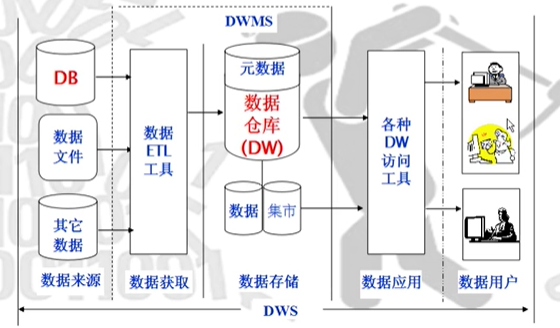

# 数据仓库与数据挖掘概述

### 1. 数据仓库与传统数据库

1. 传统型数据库

   * 定义：面向业务，对事物进行处理
   * 类似关系型数据库，对数据进行增删改查

2. 数据仓库

   * 定义：面向主题，集成，稳定，随时间变化的数据集，支持管理决策过程

   * 数据仓库的数据来源：

     * DB，数据文件，其他数据运用数据ETL工具进行数据获取

       > ETL,用来描述将数据从来源端经过抽取（extract）、转换（transform）、加载（load）至目的端的过程
       >
       > [讲解](https://www.cnblogs.com/Little-Li/p/11084024.html)

3. 两者关系

   1. 构建目的
      * 传统---> 处理日常事务
      * 数据仓库---> 为帮助管理者做决策

   **传统型数据库是创建数据仓库的一个数据源**

### 2. 数据挖掘与机器学习

1. 什么是数据挖掘
   * 定义：试图从海量数据中找出有用的知识
   * 相识的知识发现：指发现的规则
2. 什么是机器学习
   * 定义：利用经验改善计算机系统自身的性能

### 3. 数据挖掘简要分析

#### 3.1 数据挖掘的主要任务

##### 3.1.1 预测型

也可以说是有监督学习：分类回归，离群点检测等

> 数据已经给出样本类别，答案等。

1. 分类分析：用某种分类算法对表中数据进行分析，挖掘分类规则
2. 规则应用：利用数据分析预测新数据的类别，对其录入规则。

##### 3.1.2 描述型

​	也为无监督学习： 聚类, 关联分析,序列模式等

>  不知道类别和答案等

​	用聚类算法，根据给定的某种相似度标准，将没有类别标记的数据库记录集划分成若干个不相交子集（簇），使簇内的记录之间相似度很高，不同簇相似度低。	

| 类别   | 取值范围       | 理论上取值个数 |
| ------ | -------------- | -------------- |
| 离散型 | 字母或自然数   | 有限；可能无限 |
| 连续型 | 一个实数区间内 | 不可数，无限   |

例子：

#### 3.2 不同任务所需算法简述

* 分类：模型输出为离散型， 朴树贝斯，决策树，逻辑回归算法，KNN
* 回归： 模型输出为连续型
* 聚类： k-mean算法，层次聚类。
* 关联分析： Apriori等
* 序列模型： 类Apriori等

